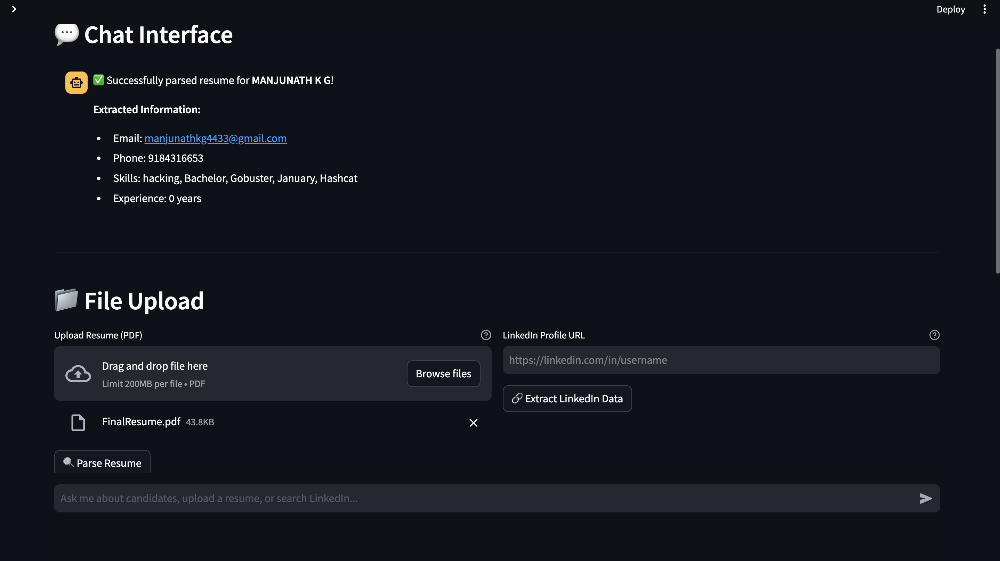

# Intelligent Chat Interface for HR Candidate Profiling

[](https://python.org)
[](https://streamlit.io)
[](https://openai.com)
[](LICENSE)

A comprehensive AI-powered system for HR professionals to automate candidate profiling, resume parsing, LinkedIn data extraction, and intelligent form generation.

## 📑 Table of Contents

- [Features](#-features)
- [Screenshots](#-screenshots)
- [Requirements](#-requirements)
- [Installation](#️-installation)
- [Quick Start](#-quick-start)
- [Usage Guide](#-usage-guide)
- [Project Workflow](#-project-workflow)
- [Architecture](#️-architecture)
- [Configuration](#-configuration)
- [Troubleshooting](#-troubleshooting)
- [Development](#-development)
- [Contributing](#-contributing)
- [License](#-license)

## 🚀 Features

### Core Functionality
- **Conversational Chat Interface**: Natural language interaction for HR tasks
- **Resume Parsing**: Extract structured data from PDF resumes using NLP
- **LinkedIn Integration**: Scrape candidate profiles and merge with resume data
- **AI-Powered Form Generation**: Automatically populate HR forms using OpenAI
- **Intelligent Data Merging**: Combine resume and LinkedIn data intelligently
- **Export Capabilities**: Generate PDF and Excel reports
- **Database Management**: SQLite-based candidate data storage

### Technical Features
- **Modern UI**: Clean, responsive Streamlit interface with chat bubbles
- **Modular Architecture**: Well-structured backend with OOP principles
- **Error Handling**: Comprehensive logging and error management
- **Caching**: Optimized performance with Streamlit caching
- **API Integration**: OpenAI GPT models for intelligent form filling

## 📋 Requirements

### System Requirements
- Python 3.10+
- 4GB RAM minimum
- 1GB free disk space

### API Keys Required
- **OpenAI API Key** (Required for AI features)
- **SerpAPI Key** (Optional, for enhanced LinkedIn scraping)
- **LinkedIn Credentials** (Optional, for direct LinkedIn access)

## 🛠️ Installation

### 1. Clone the Repository
```bash
git clone https://github.com/yourusername/intelligent-chat-interface.git
cd intelligent-chat-interface
```

### 2. Create Virtual Environment
```bash
python -m venv venv
source venv/bin/activate  # On Windows: venv\Scripts\activate
```

### 3. Install Dependencies
```bash
pip install -r requirements.txt
```

### 4. Download spaCy Model
```bash
python -m spacy download en_core_web_sm
```

### 5. Set Up Environment Variables

#### Option A: Interactive Setup (Recommended)
Run the interactive setup script:
```bash
python setup_env.py
```
This script will securely prompt you for your API keys and create the `.env` file.

#### Option B: Manual Setup
1. Copy the example environment file:
```bash
cp .env.example .env
```

2. Edit the `.env` file and add your API keys:
```env
# OpenAI API Configuration (Required for AI features)
OPENAI_API_KEY=your_actual_openai_api_key_here

# LinkedIn API Configuration (Optional)
LINKEDIN_EMAIL=your_linkedin_email@example.com
LINKEDIN_PASSWORD=your_linkedin_password

# SerpAPI Configuration (Optional, for enhanced LinkedIn scraping)
SERPAPI_KEY=your_serpapi_key_here
```

**Important**: Never commit your `.env` file to version control. It's already included in `.gitignore`.

### 6. Create Required Directories
```bash
mkdir -p data exports logs
```

## 🚀 Quick Start

### Option 1: Interactive Setup (Recommended)
```bash
# 1. Clone and setup
git clone https://github.com/yourusername/intelligent-chat-interface.git
cd intelligent-chat-interface

# 2. Create virtual environment
python -m venv venv
source venv/bin/activate  # Windows: venv\Scripts\activate

# 3. Install dependencies
pip install -r requirements.txt

# 4. Interactive API key setup
python setup_env.py

# 5. Launch application
streamlit run app.py
```

### Option 2: Manual Setup
```bash
# 1-3. Same as above, then:
# 4. Create .env file manually
cp .env.example .env
# Edit .env with your API keys

# 5. Launch application
streamlit run app.py
```

### First Steps
1. **Access Interface**: Open `http://localhost:8501` in your browser
2. **Configure API Keys**: Enter OpenAI API key in the sidebar
3. **Upload Resume**: Test with a PDF resume file
4. **Try Chat**: Use natural language commands like "Generate a form"
5. **Export Results**: Download generated forms as PDF/Excel

### Demo Mode
```bash
# Run without UI to see core functionality
python demo.py
```

## 📖 Usage Guide

### Uploading Resumes
1. Click "Upload Resume (PDF)" in the file upload section
2. Select a PDF file from your computer
3. Click "Parse Resume" to extract information
4. Review the extracted data in the candidate profile

### LinkedIn Data Extraction
1. Enter a LinkedIn profile URL in the text input
2. Click "Extract LinkedIn Data"
3. Review the extracted profile information
4. The system will automatically merge with resume data if available

### Chat Interface
Use natural language to interact with the system:
- "Search for Python developers"
- "Generate a form for the current candidate"
- "Show me all candidates"
- "Help" - for available commands

### Form Generation
1. Select a candidate from the current candidate section
2. Choose form type:
   - **Standard HR Form**: Comprehensive candidate information
   - **Interview Form**: Interview assessment and ratings
3. Export to PDF or Excel format

## 🏗️ Architecture

## 🧭 Project Workflow


### Project Structure
```
intelligent-chat-interface/
├── app.py                          # Main Streamlit application
├── config.py                       # Configuration settings
├── requirements.txt                # Python dependencies
├── README.md                       # This file
├── backend/                        # Backend modules
│   ├── __init__.py
│   ├── database_manager.py         # Database operations
│   ├── resume_parser.py            # PDF resume parsing
│   ├── linkedin_scraper.py         # LinkedIn data extraction
│   └── ai_form_filler.py           # AI-powered form generation
├── data/                           # Sample data and templates
│   ├── sample_resume.txt           # Sample resume content
│   └── sample_hr_form.json         # HR form template
├── exports/                        # Generated form exports
└── logs/                           # Application logs
```

## 📸 Screenshots

- Home
  <br/>
  

- Chat Interface & Resume Parser
  <br/>
  

- Linkedin Information Extractor
  <br/>
  

### Backend Modules

#### DatabaseManager
- SQLite database operations
- Candidate data storage and retrieval
- Skills normalization and management
- Form generation tracking

#### ResumeParser
- PDF text extraction using pdfplumber and PyMuPDF
- NLP-based information extraction using spaCy
- Skills, experience, and education parsing
- Contact information extraction

#### LinkedInScraper
- LinkedIn profile data extraction
- SerpAPI integration for reliable scraping
- Skills extraction from profile text
- Data merging with resume information

#### AIFormFiller
- OpenAI GPT integration for intelligent form filling
- Multiple form template support
- PDF and Excel export capabilities
- Professional form generation

## 🔧 Configuration

### Environment Variables
| Variable | Description | Required |
|----------|-------------|----------|
| `OPENAI_API_KEY` | OpenAI API key for AI features | Yes |
| `SERPAPI_KEY` | SerpAPI key for LinkedIn scraping | No |
| `LINKEDIN_EMAIL` | LinkedIn account email | No |
| `LINKEDIN_PASSWORD` | LinkedIn account password | No |

### Application Settings
Edit `config.py` to modify:
- Default AI model and parameters
- File paths and directories
- Database configuration
- Export settings

## 📊 Database Schema

### Candidates Table
- Personal information (name, email, phone, location)
- Professional details (position, company, experience)
- Skills and education data
- Timestamps for tracking

### Skills Table
- Normalized skill storage
- Skill categories and metadata
- Candidate-skill relationships

### Generated Forms Table
- Form type and content
- Candidate associations
- Export file paths
- Generation timestamps

## 🚨 Troubleshooting

### Common Issues

#### 1. OpenAI API Errors
```
Error: OpenAI API key not found
Error: Rate limit exceeded
Error: Invalid API key
```
**Solutions**:
- Verify API key in `.env` file or sidebar
- Check API key has sufficient credits
- Ensure key has access to GPT-3.5-turbo model
- Try reducing request frequency

#### 2. PDF Parsing Issues
```
Error: Could not extract text from PDF
Error: PDF is password protected
Error: PDF contains only images
```
**Solutions**:
- Use PDFs with selectable text (not scanned images)
- Remove password protection from PDFs
- For image-based PDFs, use OCR tools first
- Try different PDF files to test

#### 3. LinkedIn Scraping Issues
```
Error: Could not extract data from LinkedIn profile
Error: Rate limited by LinkedIn
Error: Profile not found
```
**Solutions**:
- Use SerpAPI for reliable data extraction
- Check LinkedIn URL format is correct
- Use mock data for testing
- Respect LinkedIn's rate limits

#### 4. Database Errors
```
Error: Database initialization failed
Error: Permission denied
Error: Database locked
```
**Solutions**:
- Ensure write permissions in project directory
- Close any other applications using the database
- Delete `candidate_database.db` to reset
- Check SQLite installation

#### 5. Installation Issues
```
Error: Module not found
Error: pip install failed
Error: Virtual environment issues
```
**Solutions**:
- Ensure Python 3.10+ is installed
- Use `python -m venv venv` to create fresh environment
- Update pip: `pip install --upgrade pip`
- Install dependencies: `pip install -r requirements.txt`

### Performance Issues

#### Slow PDF Processing
- Use smaller PDF files (< 5MB)
- Close other applications to free memory
- Consider using SSD storage

#### Slow AI Responses
- Check internet connection
- Reduce `max_tokens` in configuration
- Use faster models (gpt-3.5-turbo vs gpt-4)

### Debug Mode
```bash
# Enable debug logging
export STREAMLIT_LOGGER_LEVEL=debug
streamlit run app.py
```

### Performance Optimization

#### 1. Large PDF Files
- Split large PDFs into smaller sections
- Use higher-end hardware for processing
- Consider cloud-based processing for very large files

#### 2. Database Performance
- Regular database maintenance
- Index optimization for large datasets
- Consider upgrading to PostgreSQL for production use

#### 3. API Rate Limits
- Implement request throttling
- Use caching for repeated requests
- Monitor API usage and costs

## 🔒 Security Considerations

### Data Privacy
- All candidate data is stored locally in SQLite
- No data is sent to external services except OpenAI
- Implement proper access controls for production use

### API Security
- Store API keys securely
- Use environment variables for sensitive data
- Implement proper authentication for production

### LinkedIn Compliance
- Respect LinkedIn's Terms of Service
- Use official APIs when available
- Implement rate limiting and respectful scraping

## 🚀 Future Enhancements

### Planned Features
- [ ] Multi-language support
- [ ] Advanced NLP for better skill extraction
- [ ] Integration with ATS systems
- [ ] Real-time collaboration features
- [ ] Advanced analytics and reporting
- [ ] Mobile application
- [ ] API endpoints for external integration

### Technical Improvements
- [ ] PostgreSQL support for production
- [ ] Redis caching for performance
- [ ] Docker containerization
- [ ] CI/CD pipeline setup
- [ ] Comprehensive test suite
- [ ] Performance monitoring

## 🛠️ Development

### Development Commands
```bash
# Run the application
streamlit run app.py

# Run demo without UI
python demo.py

# Capture screenshots
python scripts/capture_screenshots.py

# Check code quality
python -m flake8 backend/
python -m mypy backend/

# Run tests (when available)
python -m pytest tests/
```

### Project Scripts
- `scripts/capture_screenshots.py` - Automated screenshot capture
- `setup_env.py` - Interactive environment setup
- `demo.py` - Command-line demo of core features

### Development Tips
- Use the virtual environment: `source venv/bin/activate`
- Check logs in `logs/app.log` for debugging
- Test with sample data in `data/` directory
- Use `config.py` to modify default settings

## 🤝 Contributing

### Development Setup
1. Fork the repository
2. Create a feature branch: `git checkout -b feature/amazing-feature`
3. Make your changes
4. Add tests for new functionality
5. Submit a pull request

### Code Standards
- Follow PEP 8 style guidelines
- Add comprehensive docstrings
- Include type hints where appropriate
- Write unit tests for new features
- Update documentation for new features

### Pull Request Process
1. Ensure all tests pass
2. Update README.md if needed
3. Add screenshots for UI changes
4. Request review from maintainers

## 📄 License

This project is licensed under the MIT License - see the [LICENSE](LICENSE) file for details.

## 🙏 Acknowledgments

- OpenAI for providing the GPT API
- Streamlit for the excellent web framework
- spaCy for natural language processing
- The open-source community for various libraries

## 📊 Performance Metrics

### Benchmarks
- **Resume Parsing**: ~2-5 seconds per PDF
- **LinkedIn Scraping**: ~3-8 seconds per profile
- **AI Form Generation**: ~5-15 seconds per form
- **Database Operations**: <1 second for most queries

### System Requirements
- **Minimum**: 4GB RAM, Python 3.10+
- **Recommended**: 8GB RAM, SSD storage
- **Optimal**: 16GB RAM, dedicated GPU for large-scale processing

## 📞 Support

### Getting Help
- 📖 **Documentation**: Check this README and troubleshooting section
- 🐛 **Bug Reports**: Create an issue on GitHub with detailed logs
- 💡 **Feature Requests**: Open a discussion or issue
- 💬 **Questions**: Use GitHub Discussions for community support

### Community
- ⭐ Star the repository if you find it useful
- 🍴 Fork and contribute improvements
- 📢 Share with other HR professionals

---

**Built with ❤️ for HR professionals**

*Streamlining candidate evaluation with AI-powered automation*
